# Traveling-Salesman-Problem 💼

 
 
 

# OBJETIVOS

⠀⠀⠀⠀Foi proposto pelo professor <a href="https://github.com/mpiress">Michel Pires da Silva</a>, na disciplina de Algoritmos e Estruturas de Dados II no CEFET-MG campus V no começo do mês de Novembro (2022), uma atividade em dupla na qual os alunos deveriam escolher qualquer problema real para resolve-los utilizando a estrutura dos grafos. Para tal, ficou livre para que as duplas escolhessem em qual linguagem iriam optar para a solução do problema. As linguagens disponíveis eram: <i>C, C++ e Python</i>. Para este trabalho, a dupla optou por desenvolver todo problema na linguagem <b>Python</b>, visando mais "simplicidade" para que a estrutura estudada fosse implementada. Outro fator que influênciou a escolha de determinada linguagem de programação foi que, em Python, com auxílio de bibliotecas externas, torna-se possível gerar uma imagem, facilitando a visualização do grafo.

# INTRODUÇÃO

⠀⠀⠀⠀Antes de desenvovler qualquer tipo de resenha sobre os problemas computacionais e as estruturas que serviram de base para a realização do trabalho, antes deve-se apresentar o conceito por trás dos <b>Grafos [ I ]</b>. A teoria dos grafos é um ramo da matemática, o qual estuda as relações entre os objetos de um determinado conjunto. Para que seja possível, são utilizadas estruturas chamadas de grafos, <i> <b>G (V, E)</b> </i>, onde <i><b>"V"</b></i> é um conjunto não vazio de objetos chamados de vértices,  e <i><b>"E"</b></i> (que vem do inglês edges), é um subconjunto de pares não ordenados dos vértices V. 

⠀⠀⠀⠀Certo, mas de onde veio essa teoria? Bem, para discutir sobre a origem dos grafos, é necessário voltar até o ano de 1736, onde o matemático suíço Leonhard Paul Euler ( 1707 -  1783 ), publicou um artigo sobre o Problema das Sete Pontes de Königsberg (que é considerado o primeiro resultado da teoria dos grafos). O problema é baseado na cidade de Königsberg (Kaliningrado), que é cortada pelo Rio Prégolia, onde há duas grandes ilhas, que juntas, formam um complexo que na época continha sete pontes. Discuita-se nas ruas a possibilidade de se atravessar todas as pontes, passando por todas as cidades, sem que fosse necessário passar pela mesma ponte mais de uma vez.
 

 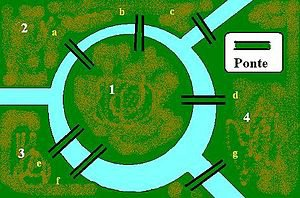

 <i>Figura I: Representação gráfica de um mapa representante do problema das sete pontes;</i>

⠀⠀⠀⠀Após esta simplória introdução ao tema, é esperado que o leitor tenha entendido que se é pode tentar visualizar de maneira "física", um grafo de inúmeras formas. Abaixo, segue um modelo genérico sobre a "aparência" de um grafo simples.
 

 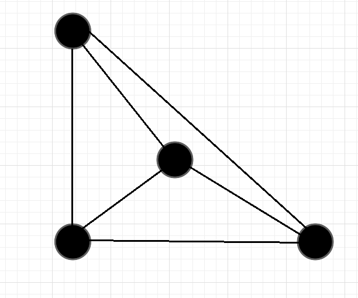 

 <i>Figura II: representação de um grafo simples;</i>

⠀⠀⠀⠀Existem duas definições quando se trata deste tipo de estrutura: os Grafos e os Dígrafos. Em literatura, as definições básicas sobre essas estruturas são ditas da seguinte maneira:

<b><i>Dígrafos</b></i> (grafos direcionados)

<ul>
    <li>Compostos por um conjunto <b>V</b> de vértices;</li>
    <li>Outro conjunto <b>E</b> de arestas;</li>
    <li>Uma estrutura de "mapa" <b>s, t</b> ➝ <b>V</b>, onde "s" é a origem (E) e "t" é o destino (E);</li>
</ul>

<b><i>Grafos</b></i> (grafos não direcionados)

<ul>
    <li>Compostos por um conjunto <b>V</b> de vértices;</li>
    <li>Outro conjunto <b>E</b> de arestas;</li>
    <li>Uma função <b>w : E</b> ➝ <b>P ( V )</b>, que associa a cada aresta um sbconjunto de dois ou de apenas um elemento de vértices, interpretado como os pontos terminais da aresta.</li>
</ul>

<b>OBS:</b> Um grafo direcionado ou não, que possui pesos nas arestas, uma função adicional <b>E ➝ R</b> realiza essa associação [aresta-valor]. Este modelo de grafos aparece em problemas de melhor rota tal como o <b>Problema do Caixeiro Viajante [ II ]</b>, próximo tópico que será abordado neste estudo.

⠀⠀⠀⠀Muito famoso e discutido dentro da área matemático-computacional, o Problema do Caixeiro Viajante é um problema que tenta determinar a menor rota para percorrer uma série de cidades e retornar a cidade de origem. Ele se mostra muito importante e essêncial, o qual deve fazer parte da bagagem de todo profissional competente na área. Em literatura, enuncia-o da seguinte forma:

"<i>Suponha que um caixeiro viajante tenha de visitar '<b>n</b>' cidades diferentes, iniciando e encerrando sua viagem na primeira cidade. Suponha, também, que não importa a ordem com que as cidades são visitadas e que de cada uma delas pode-se ir diretamente a qualquer outra.
O problema do caixeiro viajante consiste em descobrir a rota que torna mínima a viagem total.</i>"

⠀⠀⠀⠀Para exemplificar o enunciado do problema, temporáriamente, atribui-se 4 ao número '<b>n</b>' de cidades pelas quais o caixeiro deve passar. Cada cidade é representada por um número inteiro e positivo: '<b>1</b>' para a primeira cidade, '<b>2</b>' para a segunda cidade e assim por diante. Uma rota que o caixeiro poderia consiederar seria: <i>saia de 1 e vá para 2, dessa vá para 3 e caminhe para 4, por fim, retorne a 1,</i> dessa forma, fazendo o caminho 1-2-3-4-1. O problema do caixeiro é um clássico na área de problemas de otimização combinatória e é um problema da classes dos <b>NP-Difícil</b>. Ao se resolver um problema deste tipo, deve-se antes tentar reduzí-lo a um problema de enumeração: encontrar todas as possíveis rotas e calcular o comprimento de cada uma delas, dessa forma, vendo qual a menor.
 

 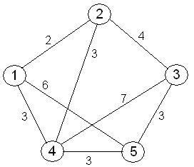

 <i>Figura III: representação de um grafo do Problema do Caixeiro Viajante;</i>

⠀⠀⠀⠀Antes de introduzir o problema no qual o trabalho será desenvolvido, é importante apresentar alguns outros conceitos essênciais para que o mesmo possa ser compreendido. Falando em caminhamento sob um grafo no qual cada vértice apenas pode ser visitado uma vez, fala-se de um conceito chamado <b>Circuito Hamiltoniano [ III ]</b>. Um caminho hamiltoniano é aquele que permite passar por todos os vértices de um grafo G, entretanto, sem repetir nenhum deles, ou seja, circuito hamiltoniano diz respeito aquele pelo qual, dado um caminho, todos os vértices serão visistados e nenhum será repetido. Neste estudo, o caminho a ser percorrido dentro do grafo pode facilmenter ser tratado como um ciclo, e por conta disso, o problema aqui tratado se encaixa perfeitamente como um ciclo hamiltoniano, como será entendido a diante no documento.

⠀⠀⠀⠀Outro conceito relevante para levar a um entendimento satisfatório do trabalho aqui documento, é sobre os algoritmos gulosos e como seu comportamento influencia um programa a encontrar sua melhor solução (ou quase). Neste tipo de método, os algortimos, durante seu processo de tomadas de decições, sempre optam por aquela que parece ser a melhor opção local. Isso implica que, em todos os casos, as escolhas serão tomadas apenas se baseando na melhor opção no momento da análise, sem "pensar" se tal escolha, trará a melhor solução global ao fim de sua execução. Pensando em algoritmos gulosos, é necessário aceitar que a decição tomada é sempre a melhor, e que um conjunto dessas, o levará a melhor solução possível para o problema. ⠀⠀⠀⠀Muitas das vezes, esse comportamento dito "guloso" o leva para a melhor solução do problema, apesar de não ser sempre, o abismo que existe em termos de facilidade durante a implementação de um algoritmo deste tipo, com algoritmos de programação dinâmica, os fazem serem escolhidos diversas vezes. Por fim, o último conceito que deve ser apresentado antes de dar início a explicação do trabalho é sobre o método de busca DFS, do inglês <i>Deep First Search</i>, ou "Busca em Profundidade" é um algoritmo usado para realizar uma busca ou travessia em alguma estrutura de dados, como: árvore, substrutura de árvores e/ou grafos. Essa forma de travessia projeta um caminho futuro e o percorre até que não seja mais possível ou chegue ao seu destino.

⠀⠀⠀⠀Com a teoria dos grafos e o Problema do Caixeiro Viajante já pré-estabelecidos, pode-se começar a discução sobre como esses dois tópicos da computação foram utilizados para a solução do problema proposto. Para este estudo, um engenheiro elétrico residente de Divinópolis que atende clientes em 9 diferentes cidades, busca a melhor rota correlacionando o tempo de trabalho que um cliente residente da cidade ' x ' irá exigir, com o ganho que terá por trabalhar para ele. É importante ressaltar que, como dito, os clientes estão espalhados pelas 9 cidades em torno de Divinópolis, entretanto, em uma semana, devido a carga horária disponível para aquela, nem todas as cidades serão sempre visitadas pelo engenheiro. Visando evitar prejuízo, o caminho pelo qual será percorrido para prestar seu serviço deve ser minuciosamente calculado. Afinal, cada semana terá uma carga horária diferente a ser comprida, portanto, o maior valor em dinheiro deve ser convertido a partir desta limitação horária.

⠀⠀⠀⠀Este mapa da região Centro-Oeste de Minas Gerais demarca todas as cidades onde os clientes moram/trabalham, bem como define Divinópolis como sendo a origem e destino final, ou seja, torna-se um ciclo hamiltoniano com algumas alterações, uma vez que, a partir da carga horária disponível, nem todas as cidades poderão ser visitadas, uma vez que, ao fim da semana, o engenheiro deve retornar a Divinópolis para que possa voltar até sua casa (sem que exceda a carga horária daquela semana de serviço).
 

 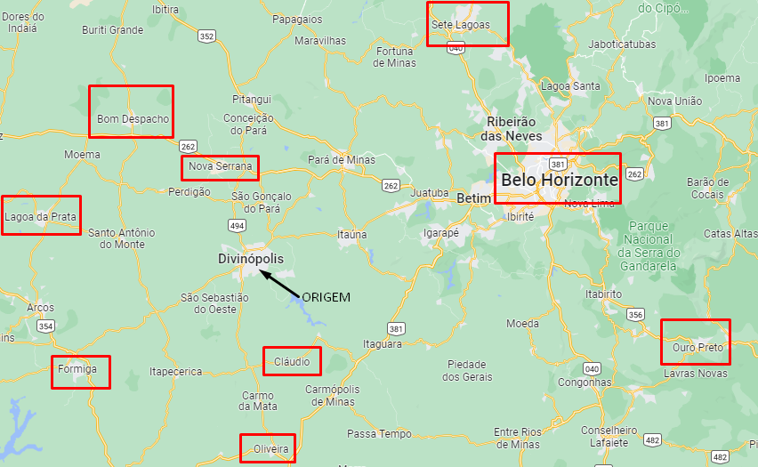 

 <i>Figura IV: região de atuação para o estudo, partindo de Divinópolis;</i>

⠀⠀⠀⠀Com o auxílio das bibliotecas externas: <i><b>matplotlib [ IV ], numpy [ V ], scipy [ VI ] </b>e do pacote <b>NetWorkX [ VII ] </i></b>, a partir da organização das coordenadas (o que será mostrado mais a diante do trabalho), tornou-se possível visualizar a estrutura do grafo na qual o algoritmo irá trabalhar encima. Percebe-se que o grafo apresenta uma estrutura muito satisfatória, uma vez que é possível compara-lo e perceber as semelhanças com o mapa de Minas Gerais.
 

 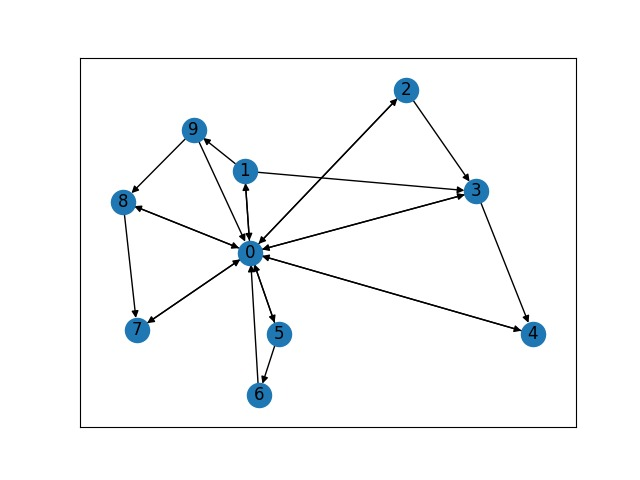 

 i>Figura V: grafo gerado a partir do mapa de Minas Gerais presente na Figura IV;</i>

⠀⠀⠀⠀Ademais, vale reforçar a importância de levar em consideração não apenas o tempo de deslocamento para sair de uma cidade ' x ' e chegar em ' y ', mas também o gasto de combustível da viagem. Se tratando de trabalho, o ganho oriundo do serviço prestado para os clientes, deve ser capaz de suprir os gastos do combustível, bem como gerar lucro. Visando maximizar a otimização do uso do tempo/combustível, algumas regras são criadas referentes as visitas em algumas certas cidades. Para que o engenheiro possa ir trabalhar em Bom Despacho, por exemplo, ele deve, obrigatóriamente, trabalhar antes ou em Nova Serrana, ou em Lagoa da Prata, uma vez que não é possível chegar a Bom Despacho sem antes passar por estas cidades. Essa situação acontece novamente quando o engenheiro precisa prestar serviço na cidade de Oliveira. Para chegar ao seu destino, ele deve antes passar e trabalhar em Cláudio primeiro, uma vez que estão no "mesmo" caminho.

⠀⠀⠀⠀Por conta disso, o consumo do carro utilizado para o transporte durante as viagens a trabalho é importante e tem papel fundamental na construção do grafo, juntamente com o tempo gasto durante o deslocamento. Para tal, foi construida a seguinte tabela contendo todas as informações necessárias para a construção e organização do grafo. O carro utilizado para realizar o transporte até as cidades é um <i>Ford Ka S. (sedan) 1.5</i> de ano 2015, o modelo apresenta consumo médio em vias rodoviárias de ± 13,6 Km/L segundo o site <b>carrosnaweb [ VIII ]</b>.
 

| Percurso               |  Distância                         |  Tempo       | Consumo    |       
| :-----------------------:| :-----------------------------------:|:--------------:|:------------:|
|  <i>Divinópolis ➝ Nova Serrana</i>        | 44,8 Km                            |0,75 h        |3,29 L      |
|  <i>Divinópolis ➝ Sete Lagoas</i>        | 180,3 Km                           |2,93 h        |13,25 L     |
|  <i>Divinópolis ➝ Belo Horizonte</i>        | 127,8 Km                           |2,13 h        |9,39 L      |
|  <i>Divinópolis ➝ Ouro Preto</i>        | 209,4 Km                           |3,38 h        |15,39 L     |
|  <i>Divinópolis ➝ Cláudio</i>        | 55,7 Km                            |0,86 h        |4,09 L      |
|  <i>Divinópolis ➝ Oliveira</i>        | 70,8 Km                            |1,05 h        |5,20 L      |
|  <i>Divinópolis ➝ Formiga</i>        | 80,9 Km                            |1,28 h        |5,94 L      |
|  <i>Divinópolis ➝ Lagoa da Prata</i>        | 96,6 Km                            |1,61 h        |7,10 L      |
|  <i>Divinópolis ➝ Bom Despacho</i>        | 79,6 Km                            |1,21 h        |5,85 L      | 
|  <i>Lagoa da Prata ➝ Bom Despacho</i>        | 52,4 Km                            |1,03 h        |3,85 L      | 
<i>Nova Serrana ➝ Bom Despacho</i>        | 36,7 Km                            |0,61 h        |2,69 L      | 
<i>Cláudio ➝ Oliveira</i>        | 46,1 Km                            |0,75 h        |3,38 L      | 

<i>Tabela 1: Informações essenciais para a resolução do trabalho;</i>
 

⠀⠀⠀⠀Diante do exposto, o leitor agora está apto para ler sobre como tal processo foi implementado, passando passo a passo pelo código desenvolvido, afim de solucionar o problema proposto.

# LÓGICA

⠀⠀⠀⠀Para que fosse possível inicializar o grafo e começar operar suas configurações iniciais, criou-se o arquivo <i>'node.py'</i>, no qual a classe <code>Node( )</code> é criada e se refere aos vértices que serão utilizados no grafos. Nesta, o construtor da classe do vértice se incia, recebendo os seguintes parâmetros: (<code>self, id, bounty, time_spent</code>). A respeito destes parâmetros, o 'self' funciona como o 'this ➝' do C++; o 'id' representa o número do vértice, no caso, as cidades que serão visitadas; 'bounty' diz respeito a quantia que o engenheiro irá receber ao visitar tal cidade e prestar seu serviço; e 'time_spent' o tempo que será gasto para atendimento do cliente.
 

 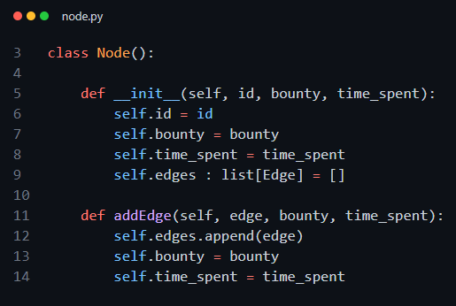 

 <i>Figura VI: representação de como foi criada a classe referente aos Nós (vértices) do grafo;</i>

⠀⠀⠀⠀Com os vértices inicializados, foi necessário criar agora a classe referente as arestas do grafo. Seguindo o mesmo padrão da classe <code>Node( )</code>, a classe <code>Edge( )</code> também recebe algumas configurações iniciais como parâmetros, são elas: (<code>self, gas_cost, distance, begin, end</code>). Em que cada um, equivale a repectivamente: o mesmo 'this ➝' do C++, o custo da gasolina (por cada litro consumido pelo veículo durante os percursos), a distância a qual o engenheiro terá que dirigir até que chegue em seu cliente e os vértices de partida e chegada, neste caso, a cidade em que ele deixou e a cidade na qual ele pretende chegar. Devido a estas informações carregadas pelas arestas, agora tem-se arestas as quais carregam: seus pesos, vértice inicial e vértice final, bem como uma variável booleana que tornará possível a movimentação pelo grafo.
 

 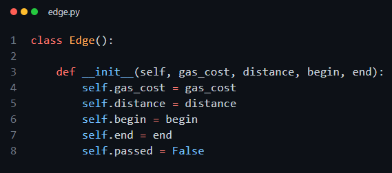 

 <i>Figura VII: representação de como foi criada a classe referente as Arestas do grafo, bem como foram feitas suas atribuições;</i>

⠀⠀⠀⠀Neste ponto, o grafo já conta com o vértices e arestas capacitados para receberem todas informações necessárias para o funcionamento do programa. Por conta disso, agora será tratado exatamente este ponto: onde e como conseguir tais informações. Bem, o programa foi desenvolvido de tal forma para que os dados fundamentais para a execução do programa fossem coletados a partir de um documento de extensão <code>.txt</code>. O usuário deve inserir todas as informações que aqui já foram citadas em um arquivo que, naturalmente, deve ser nomeado como <code>DADOS.txt</code> (vale ressaltar que este nome pode ser facilmente alterado por outro, bastando apenas alterar a linha < 6 > no <code>main.py</code>. Dentro deste arquivo, é importante que os dados estejam dispostos de uma maneira específica, segue exemplo:
 

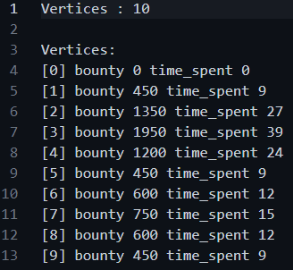
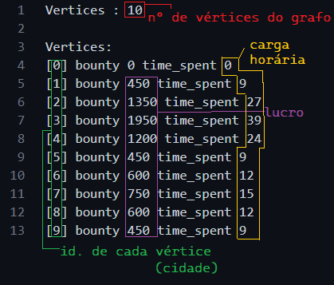

 <i>Figuras VII e IX: exemplo de como deve ser configurado o arquivo "DADOS.txt";</i>

<b>OBS: vide <i>"Figura V"</i> para ficar mais claro a quais cidades os números de identificação equivalem;</b>  

⠀⠀⠀⠀Ainda no arquivo de entrada no qual o usuário tem liberdade para alterar quaisquer configurações que deseja, é necessário a informação sobre os arcos entre os vértices também. Isto é: deve ser informado a distância (em horas, no caso deste trabalho que envolve viagens rodoviárias) entre um vértice e outro (cidades), bem como o gasto médio de combustível para realizar tal viagem. Para tal, foi construída a seguinte estrutura que abrange todos os caminhos possíveis, pelos quais o engenheiro pode passar em algumas de suas viagens:
 

 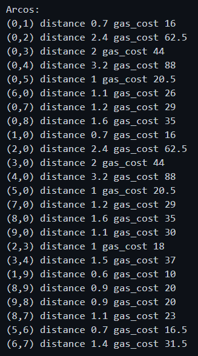 

 <i>Figura X: exemplo de como deve ser escrita as informações sobre os arcos presentes no grafo;</i>

⠀⠀⠀⠀Certificando que o arquivo de leitura foi configurado corretamente, pode-se começar a explicar como foi desenvolvido e aplicado o método de leitura do mesmo, assim possibilitando a execução do programa como esperado. Para ler, interpretar e absorver os dados presentes no arquivo de entrada, os subprogramas do arquivo <code>process_file.py</code> foram criados.

⠀⠀⠀⠀A primeira delas, <code>processfile( )</code> tem um papel simples, porém muito importante para que as demais consigam operar com sucesso: separa todo o arquivo em linhas. Tal ação é realizada utilizando de um loop <i>for</i>, salvando cada linha em uma variável "<code>line</code>" ➝ muito parecido com o formato utilizado para realizar tokenizações em C++. Seguindo com a função <code>processLine( )</code> responsável por "separar" o arquivo, removendo do arquivo, os espaços presentes entre as strings. Dessa forma, já possível criar as arestas, afinal, já estão isolados, fazendo assim a chamada da função <mark>buildEdge( ) *</mark>, que recebe como parâmetro o "pedaço" cortado do arquivo e o grafo como um todo, criando assim, o primeiro e os demais.

⠀⠀⠀⠀Entrando na função chamada <code>getNumberOfNodes( )</code>, como o nome já sugere, lê no arquivo a quantidade de vértices e a define no grafo. A próxima função essêncial para o funcionamento do programa é a chamada <code>getFloatValueFromTitle( )</code>. Pode parecer confuso lendo o nome dado, porém, o que essa função realiza é retornar como um valor flutuante (Float), dado uma string do arquivo, além de remover possíveis '\n', que podem aparecer ao fim das strings lidas. O funcioamento dessa função utiliza do bloco <i>Try Catch</i>, normalmente usado para tratamentos de exceções.

⠀⠀⠀⠀A função <b><code>buildEdge( ) *</code></b>, citada anteriormente, é responsável por construir uma aresta de acordo com os dados coletados anteriormente pelo arquivo. Com os valores coletados, a função é capaz de ler a distância informada, bem como o consumo médio esperado para tal trajeto. Além disso, a função também adiciona o vértice inicial e o final para a aresta em questão, de forma que, no fim, se tem um vértice com os seguintes atributos:

>edge = Edge{
    ⠀⠀⠀gas_cost,
      ⠀    ⠀  distance,
      ⠀⠀  ⠀begin,
      ⠀⠀  ⠀end
}

⠀⠀⠀⠀Assim como a função <code>buildEdge( )</code>, que tem como principal objetivo criar as arestas presentes no grafo, a função <code>buildNode( )</code> vem com o propósito praticamente igual. Nesta, o programa constrói um novo vértice, também de acordo com as informações coletadas do arquivo de entrada. Enquanto a outra função ficava responsável por coletar e adicionar a distância e o custo de combustível envolvido, esta agora objetiva alcançar a definição da recompensa sobre o trabalho realizado pelo engenheiro na cidade 'X', bem como definir o tempo no qual tal serviço levará para ser concluido. A função <code>verifyNode( )</code> faz a verificação se algum vértice já consta dentro da estrutura do grafo. Caso seja encontrado, a função retorna <i>true</i>, e o não adiciona, visto que não é possível ter vértices iguais, entretanto, caso o vértice seja novo, ou seja, não foi encontrado dentro do grafo, é adicionado ao grafo.
 

 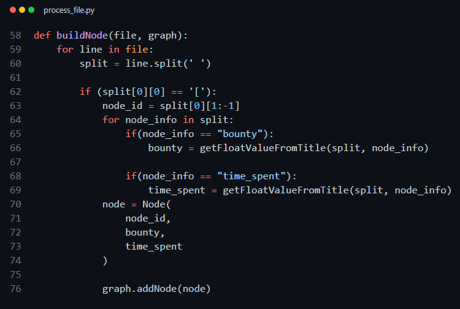 

 <i>Figura XI: função responsável por criar os vértices do grafo a partir dos dados lidos do arquivo de entrada;</i>

⠀⠀⠀⠀Com tudo individualmente pronto, usou-se o arquivo <code>graph.py</code>, que conta com uma série de funções que objetivam juntar harmônicamente todos os elementos do grafo, tornando possível o funcionamento do programa. Logo de começo, o construtor da classe "grafo" é acionado, desta forma, garantindo que todas as varáveis, tais como as listas de: arestas do grafo, número de vértices do grafo, os próprios vértices, arestas, vértices que já foram visitados e as demais, como por exemplo: o número de vértices, carga horária e o ganho total, são zeradas, evitando que haja armazenamento desnecessário com lixo de memória. Ademais, é neste instânte que o grafo direcionado é formado, utilizando a biblioteca <code>NetWorkX</code>.

⠀⠀⠀⠀Para possibilitar a visualização do grafo por parte do usuário, criou-se a função <code>printGraph( )</code>. Nesta, as configurações referentes as coordenadas dos vértices são passadas para o vetor '<i>pos</i>'. Com as configurações posicionais já definidas, um loop <i>for</i> passa pela lista dos vértices e colore da seguinte maneira: 
 

<b>
🔵: Vértices ainda não visitados são pintados de azul; 
🟢: Vértices já visitados são pintados de verde; </b>

  

⠀⠀⠀⠀Lembrando que todo o funcionamento desta função apenas é possível devido as ferramentas da biblioteca citada anteriormente e seu recurso "<code>draw_network</code>" e "<code>show( )</code>" para mostrar o resultado na tela.

⠀⠀⠀⠀Outra função de extrema importância para o funcionamento ideal do programa é a chamada <code>existNode( )</code>. Sua função é simples: ela recebe um 'id' (vértice), e realiza a verificação se este existe e, caso exista, verifica se tal vértice já foi ou não visitado anteriormente. Caso a função verifique que o vértice já foi visitado, retorna <i>true</i>, caso contrário, retorna <i>false</i>. Tal verificação é importânte pois o trajeto que será percorrido durante a execução do programa depende diretamente do conhecimento sobre quais dos vértces já foram ou não foram visitados. Vértices visitados durante a execução do programa são adicionados a uma lista específica, para que, quando necessário, seja possível ter fácil acesso aos mesmos (os vértices já visitados). Da mesma maneira, a função <code>verifyEdge( )</code> realiza o exato mesmo tipo de verificação, entretanto, ao invés de receber vértices e os validar, recebe as arestas do grafo.

⠀⠀⠀⠀Para o caminhamento, utilizou-se um misto de dois tipos de programação: guloso e dinâmico. Devido a isso, a procura pelo melhor caminho possível dentro da estrutura do grafo é realizado de maneira a utilizar princípios de ambos os modelos de programação. A função <code>find_BestStep( )</code> é responsável pelo caminhamento de forma gulosa. Durante sua execução, um loop <i>for</i> caminha pelos vértices e, a partir de estruturas de controle <i>ifs</i>, realiza a verificação a respeito de descobrir se o ganho do vértice da outra "ponta" da aresta possui um valor maior referente ao lucro que já está registrado em <code>max_bounty</code>, ou seja, o maior até então. A outra verificação realizada dentro desta função é a respeito da carga horária, "dada a carga-horária" atual, é possível caminhar para determinado vértice ' X ' e retornar para o ponto inicial (Divinópolis)? A aresta necessária para realizar este caminhamento, já foi anteriormente utilizada?". ⠀⠀⠀⠀Com o auxílio da função <code>can_ChooseEdge( )</code> (responsável por validar se é possível percorrer por alguma aresta ' X ' no grafo), se for validado tal caminho, o programa adiciona o vértice na lista de já visitados e atualiza o ganho total, bem como desconta no saldo de carga-horária restante.
 

 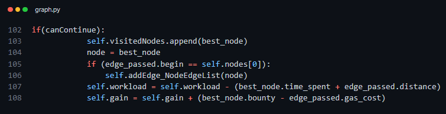 

 <i>Figura XII: funcionamento da função caso seja verificado que o próximo ponto de viagem é possível;</i>

⠀⠀⠀⠀Caso contrário, se for verificado que a próxima cidade (vértice) que será visitada irá desobedecer a regra imposta pelo programa, ou seja: não será possível retornar para Divinópolis após prestar serviço para os clientes da cidade ' X ', seja por indisponibilidade de arestas, ou por falta de tempo. O programa então trata de retornar o engenheiro até sua casa e atualiza o ganho total, bem como a carga-horária, finalizando assim a execução.

 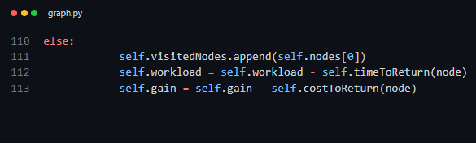 

 <i>Figura XIII: funcionamento da função caso seja verificado que o próximo ponto de viagem <b>NÃO</b> é possível, independente do motivo;</i>

⠀⠀⠀⠀A próxima função que ser discutida é a chamada <code>gulosoMaxValue( )</code>. Esta, recebe os dados referentes a carga-horária e executa o programa, verificando todas as possibilidades de caminho a partir de um intermédio entre programação dinâmica e o método guloso. "Dicionários" <b>[ IX ] </b> em <i>Python</i> são uma coleção que guarda valores multidimensionais para cada índice. Seu comportamento pode ser comparado as funcionalidades da função <code>pair< x, y ></code>, utilizadas no C++ em alto nível. Utilizando desta estrutura de dados, o resultado final do programa será armazenado em um dicionário de nome <code>results_dict</code>. Durante a execução do programa, enquanto for possível viajar, partindo de divinópolis, a função <code>find_BestStep( )</code> (já mencionada aqui neste documento), continuará sendo executada, sempre realizando a verificação sobre se a carga-horária ainda disponível, é suficiente para percorrer o próximo caminho até o vértice seguinte.

⠀⠀⠀⠀Uma vez realizado o percurso, é necessário voltar para o ponto de origem. Para isso, as funções <code>timeToReturn( )</code> e <code>cotToReturn( )</code> são responsáveis por, respectivamente, receber um vértice e, a partir deste, retornar o tempo necessário para voltar até Divinópolis e o custo referente ao combustível necessário para voltar até a cidade origem. Por fim, a função <code>cleanVariables( )</code> limpa todas as variáveis utilizadas durante o looping "<i>dinâmico-guloso</i>".

# RESULTADOS OBTIDOS

⠀⠀⠀⠀Exemplificando o funcionamento do programa, tens aqui dois exemplos de execução. Em um deles, o usuário informa ao código que deseja que o cálculo seja feito para otimizar as opções de viagem com uma carga horária de 30h. De acordo com o esperado, o programa deve retornar ao usuário da seguinte maneira:
 
<ul>
    <li>Uma mensagem confirmando que o melhor caminho foi encontrado;</li>
    <li>Qual foi o caminho percorrido, a partir dos números dos vértices representando as cidades (vide figura IX);</li>
    <li>O lucro total arrecadado a partir das viagens feitas.</li>
</ul>

⠀⠀⠀⠀Bem, se tudo estiver dentro dos conformes, com essas configurações iniciais de 30 e 60h semanais informadas pelo usuário, o programa deve reagir como mostram as figura abaixo.
 

 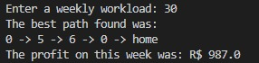 

 <i>Figura XIV: Saída esperada do programa ao receber como configuração inicial de 30h;</i>

 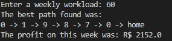 

 <i>Figura XIV: Saída esperada do programa ao receber como configuração inicial de 60h;</i>

⠀⠀⠀⠀Como esperado, os resultados são congruentes e apresentam valores satisfatórios e próximos aos pensados durante o desenvolvimento do programa. Por tanto, conclui-se que a tarefa foi concluída com êxito dentro do que foi pedido pelo professor em sala de aula.

# COMPILAÇÃO E EXECUÇÃO

⠀⠀⠀⠀Para que seja possível a compilação do programa, é necessário que o usuário instale o software <i>Python 3</i> em sua máquina, tornando possível a compilação de programas Python. Além do mais, é necessário instalar por fora as bibliotecas que foram utilizadas. As bibliotecas que necessáriamente precisam estar instaladas são: <i>NetWorkX, <b>CONTINUAR AQUI</b></i> .Feito, basta que o usuário siga o seguinte passo a passo: 

* Abrir o arquivo no Visual Studio Code;
* Usar o atalho <kbd>RMB + "Abrir terminal integrado"</kbd>;
* Com o terminal aberto, basta digitar >python3 src/main.py
* Por fim, basta que o usuário informe a quantidade de horas semanais desejadas para o funcionamento do programa;

# REFERÊNCIAS
[ I ] https://pt.wikipedia.org/wiki/Teoria_dos_grafos  
[ II ] http://www.mat.ufrgs.br/~portosil/caixeiro.html  
[ III ] https://www.inf.ufsc.br/grafos/temas/hamiltoniano/hamiltoniano.htm   
[ IV ]https://matplotlib.org/  
[ V ] https://numpy.org/  
[ VI ] https://scipy.org/  
[ VII ] https://networkx.org/  
[ VIII ] https://www.carrosnaweb.com.br/fichadetalhe.asp?codigo=2274  
[ IX ] https://blog.somostera.com/desenvolvimento-web/dicionario-python#.  

## REFERÊNCIAS INDIRETAS

* https://cplusplus.com/
* https://www.python.org/downloads/
* https://www.ensinoeinformacao.com/teoria-dos-grafos
* https://www.google.com.br/maps
* https://www.youtube.com/watch?v=IzG9l_7GaZM&t=1067s&ab_channel=ProfessorDouglasMaioli

# AUTORES
Desenvolvido por João Pedro Martins Espíndola; 
Documentado por Henrique Souza Fagundes;

Alunos do 4° periodo do curso de `Engenharia da Computação` no [CEFET-MG](https://www.cefetmg.br)
